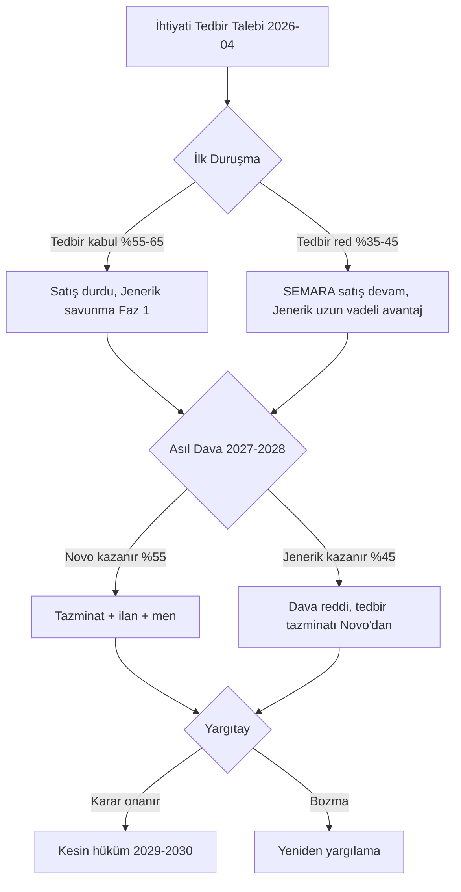

# examples/litigation-ornek-fshhm.md — FSHHM Patent Dava Briefing Filled Example

> **Kullanım notu**: Hipotetik bir vakadır, eğitim amaçlıdır. Gerçek FSHHM (Fikri ve Sınai Haklar Hukuk Mahkemesi) davası için patent vekili + dış hukuk müşaviri + bilirkişi koordinasyonu + HMK usul kurallarına tam uyum zorunludur. Burada dava stratejisi + prosedürel yol haritası + tazminat hesabı gösterilmektedir.

---

# Litigation Briefing — Novo Nordisk A.Ş. vs [Jenerik Firma] Semaglutide Patent İhlali Davası

**Dosya No**: İstanbul 2. FSHHM 2026/XXX E. (hipotetik)
**Versiyon**: v1.0 — 2026-04-24
**Hazırlayan**: [Patent Vekili + Dış Hukuk Müşaviri] — [Müvekkil Firma]
**Dağıtım kısıtı**: GİZLİ — AVUKAT-MÜVEKKİL AYRICALIĞI + WORK PRODUCT
**Hedef kitle**: Executive (CEO, CFO, GC) + Klinik/Regülatör (CMO, QA/RA)
**Şablon kaynağı**: `rapor-sablonlari.md §6 Litigation Briefing`

---

## 1. Yönetici Özeti (BLUF)

**Dava özeti**: Novo Nordisk A.Ş., hipotetik **[Jenerik Firma]**'nın **SEMARA® 1mg/dose** semaglutide jenerik ürünü için **ihtiyati tedbir + asıl dava** (patent tecavüzü + haksız rekabet) açmıştır. Davaya konu patent: **EP2059533 T3** (TR milli tarafa geçiş) — "Semaglutide composition of matter", expiry 2031-05-23.

**Çekirdek iddialar**:
- Novo: SEMARA®, EP2059533 İstem 1 kapsamına girer → patent tecavüzü
- Jenerik firma savunması: (1) patent hükümsüz (yenilik + buluş basamağı), (2) Bolar istisnası (SMK m. 85/3), (3) design-around

**Taraf stratejik pozisyon**:
- **Novo (davacı)**: Temel molekül patent güçlü, pazar savunma esaslı
- **Jenerik (davalı)**: TR pazar giriş 2029 hedefi (patent öncesi ruhsat hazırlık); hükümsüzlük + dava erteleme stratejisi

**Forum**: **İstanbul 2. FSHHM** (Fikri ve Sınai Haklar Hukuk Mahkemesi), Ankara alt-senaryosu.

**Takvim ön görüsü**:
- İhtiyati tedbir kararı: **3-6 ay** (ilk duruşma 2026-Q3)
- Asıl dava karar: **18-30 ay** (2027-2028)
- Yargıtay temyiz: **+18-24 ay** (2029-2030)
- YİDK paralel hükümsüzlük: **12-18 ay**

**Finansal değerlendirme**:
- Novo için tazminat talep: **≥ ₺25M** (SMK m. 151 pazar kaybı + kâr kaybı)
- Jenerik için risk: ihtiyati tedbir halinde pazar erteleme + %50-70 hasar değer kaybı
- Müzakere/settlement fırsatı: **mevcut** (royalty lisans yoluyla Novo pazar payı korunması)

**Öneri**:
- Davacı için: Agresif ihtiyati tedbir + paralel AB + ABD enforcement
- Davalı için: Hükümsüzlük başvurusu YİDK'ye derhal + Bolar savunma + settlement müzakere hazırlık

---

## 2. Dava Arka Planı

### 2.1. Kronoloji

| Tarih | Olay |
|---|---|
| 2005-05-23 | Novo Nordisk EP2059533 öncelik başvurusu |
| 2012-06 | EP2059533 granted (EPO), TR milli faz geçiş 2012-08 |
| 2017-12 | Ozempic FDA onayı (semaglutide — T2DM) |
| 2021-06 | Wegovy FDA onayı (semaglutide — obezite) |
| 2023-12 | Türkiye'de Ozempic TİTCK onayı |
| 2025-03 | [Jenerik Firma] **SEMARA® biyoeşdeğerlik çalışması başlatıldı** (Türkiye) |
| 2025-11 | SEMARA® TİTCK ruhsat başvurusu (SMK m. 85/3 Bolar kapsamında) |
| 2026-01 | SEMARA® ruhsat verildi (Novo itirazı TİTCK'da reddedildi) |
| **2026-03-15** | **[Jenerik Firma] SEMARA® satışa arz — ihtiyati tedbir tehdidi** |
| **2026-04-02** | **Novo Nordisk A.Ş. dava + ihtiyati tedbir talebi (İstanbul 2. FSHHM)** |
| 2026-04-20 | İlk duruşma planlandı |

### 2.2. Ürün karşılaştırması

| Özellik | Ozempic (Novo) | SEMARA® ([Jenerik Firma]) |
|---|---|---|
| Aktif madde | semaglutide | semaglutide |
| Konsantrasyon | 1 mg / 0.74 mL | 1 mg / 0.74 mL |
| Formülasyon | Novo tescilli formülasyon | Alternatif formülasyon (iddia) |
| Cihaz | FlexTouch pen | [Jenerik pen] |
| Uygulama | Haftalık SC | Haftalık SC |
| Endikasyon | T2DM + obezite | T2DM (Bolar) |

### 2.3. Hukuki temel

**Novo talep gerekçeleri**:
- SMK m. 85 — Patent ihlali
- SMK m. 149 — Tecavüz tazminatı
- SMK m. 151 — Tazminat hesabı (davacı kâr kaybı, davalı kâr elde etme, makul lisans bedeli)
- TTK m. 54-56 — Haksız rekabet
- HMK m. 389 vd. — İhtiyati tedbir

**Davalı savunma temeli**:
- SMK m. 85/3 — Bolar istisnası (ruhsat için deneme)
- SMK m. 139 — Hükümsüzlük (yenilik, buluş basamağı)
- TMK m. 2 — Dürüstlük kuralı (Novo'nun iyi niyetli ihtiyati tedbir talep etmediği iddiası)
- TTK m. 57 — Haksız rekabet dengeleme

---

## 3. Taraflar + Talepler

### 3.1. Davacı: Novo Nordisk A/S + Novo Nordisk Sağlık A.Ş.

**Tüzel kişilik**:
- Novo Nordisk A/S — Danimarka (patent sahibi)
- Novo Nordisk Sağlık A.Ş. — Türkiye (ticari temsilci, davacı)

**Ticari menfaat**: 2024 Türkiye Ozempic cirosu ~₺500M; jenerik girişi %60-80 fiyat düşüşü + pazar payı kaybı.

**Talepler**:
1. İhtiyati tedbir: SEMARA® satışının derhal durdurulması
2. Tecavüzün tespiti
3. Tecavüz eyleminin durdurulması (men)
4. Tazminat: Primer ₺25M + temerrüt faizi + enflasyon
5. Hüküm özetinin basın yayın yoluyla ilanı (SMK m. 150)
6. Mahkeme masrafları + vekil ücreti

### 3.2. Davalı: [Jenerik Firma] A.Ş.

**Tüzel kişilik**: TR yerli sermayeli farmasötik üretici (Gebze tesis).

**Ticari menfaat**: SEMARA® ilk 12 ayda ~₺60-80M pazar projeksyonu.

**Savunmalar**:
1. Patent hükümsüz (YİDK paralel başvuru ile)
2. Bolar istisnası — henüz patent süresi dolmamış ama ruhsat hazırlık yasal
3. Design-around — farklı formülasyon + cihaz
4. Novo'nun İstem 1 yorumu çok geniş (doktrin uyumsuzluğu)
5. Haksız rekabet karşı davası (Novo'nun ihtiyati tedbir talep etmesi zararın genişlemesi)

**Karşı talepler**:
1. İhtiyati tedbir reddi
2. Davanın reddi
3. Novo aleyhine haksız rekabet tazminatı (TTK m. 54)

---

## 4. Forum Seçimi — İstanbul 2. FSHHM

### 4.1. Yetki analizi (HMK + SMK)

**FSHHM yetki**:
- SMK m. 156 — Fikri ve Sınai Haklar Hukuk Mahkemeleri özel yetkisi
- Tüm SMK kapsamlı patent davaları FSHHM'de görülür (Türkiye'de 7 merkez: İstanbul 2, Ankara 2, İzmir 1, Antalya 1, Bursa 1, Adana 1, Kayseri 1)

**Yer yetkisi** (HMK m. 6-15):
- Davalı ikametgahı: Gebze (Kocaeli) → Kocaeli Asliye Ticaret yetkili değil, İstanbul FSHHM
- Davacı tercihi: İstanbul 2. FSHHM
- Alternatif: Ankara 2. FSHHM (YİDK idari kararına yakın)

### 4.2. İstanbul vs Ankara FSHHM

| Kriter | İstanbul 2. FSHHM | Ankara 2. FSHHM |
|---|---|---|
| Ortalama dava süresi | 18-30 ay | 20-32 ay |
| Hakim uzmanlık | Patent dava deneyimi yüksek | YİDK ile çapraz deneyim |
| Bilirkişi pool | İstanbul Üniversitesi + Bilkent + ODTÜ | Ankara Üniversitesi + Hacettepe + Bilkent |
| Davacı kazanma (2020-2024) | ~%55 | ~%50 |
| İhtiyati tedbir başarı | ~%40 | ~%35 |

**Karar**: İstanbul 2. FSHHM — davacı yararına hafif avantaj.

### 4.3. Paralel forumlar

**YİDK (TÜRKPATENT Yeniden İnceleme ve Değerlendirme Kurulu)** — hükümsüzlük idari itiraz:
- Davalı paralel başvuru yapacak
- Karar süresi: 12-18 ay
- YİDK red → FSHHM paralel dava

**EPO Opposition**:
- Opposition süresi EP2059533 için geçti (9 ay pencere 2013'te kapandı)
- Alternatif: Ulusal hükümsüzlük davası AB üyelerinde

**UPC (Unified Patent Court)**:
- EP2059533 klasik EP patent — UPC opt-out değerlendirme
- Türkiye UPC üyesi değil, TR için ilgisiz

---

## 5. İhtiyati Tedbir Stratejisi

### 5.1. HMK m. 389 kriterleri

Novo'nun ihtiyati tedbir başarı için ispatlaması gerekenler:

**1. Hakkın tehlikede olması**: Patent ihlali devam ediyor (SEMARA® satışı); her gün pazar payı kaybı + fiyat erozyonu.

**2. Gecikmenin telafisi imkânsız zarar**:
- Novo'nun patent süresi 5 yıl (2026 → 2031)
- Jenerik gidişi geri çevrilebilir değil (hastaların SEMARA'ya alışması)
- Fiyat düşüşü birikimli ve kalıcı

**3. Yaklaşık ispat**: Patent + bağımsız test + laboratuvar analiz = prima facie ihlal.

### 5.2. İhtiyati tedbir talebi bileşenleri

1. **Satışın durdurulması** — SEMARA® tüm kanallarda satış yasağı
2. **Üretimin durdurulması** — Kocaeli tesisi
3. **Stok el konulması** — depolardaki stoklar
4. **Gümrük tedbiri** — gelecek ithalat önleme
5. **Tanıtım + pazarlama yasağı** — reklam, KOL ilanları
6. **Mali durumunun koruması** — şirket banka hesapları (opsiyonel)

### 5.3. Teminat (HMK m. 392)

Mahkeme teminat belirleyecek:
- Novo'nun riski: tedbir haksız çıkarsa davalıya tazminat
- Tahmini teminat miktarı: **₺5-15M** (SEMARA® 6 aylık ciro tahmini)
- Banka teminat mektubu + nakit depo kombinasyonu

### 5.4. Karşı tedbir risk (HMK m. 398)

Davalı haksız tedbir alındığı iddiasıyla:
- Tedbir kaldırılması talep edebilir
- Ek teminat talep edebilir
- Haksız tedbir tazminatı (ilerde)

### 5.5. Başarı olasılığı

**Novo tarafı**:
- Patent + açık istem kapsamı → **%55-65 başarı**
- Zorluk: patent'in görünen hükümsüzlük riski

**Jenerik tarafı**:
- Bolar argumanı sınırlı (pazara arz → Bolar dışı)
- Tedbir reddi olasılığı **%35-45**

**Karar ağacı**: `visualize:show_widget` — `litigation-decision-tree` şablonu



---

## 6. Teknik Delil + Bilirkişi Hazırlığı

### 6.1. İstem analizi (EP2059533 T3 İstem 1)

```
1. Peptid kompozisyon, içeren:
   (a) N-terminal(ε)-[(S)-(2-[2-(2-amino-etoksi)-etoksi]-asetil)-(γGlu)
       -17-(karboksiheptadekanoil))Lys26 modifikasyonu;
   (b) Arg8 → Glu8 substitüsyonu;
   (c) Gly35'te pozisyon değişikliği;
   ve GLP-1(7-37) backbone.
```

### 6.2. Özellik-özellik matrisi

`scripts/claim-parser.py` çıktısı:

| F# | İstem özelliği | SEMARA® ürün | Eşleşme |
|---|---|---|---|
| F1 | Aib8 substitüsyonu | Evet | ✓ |
| F2 | Arg34 → Lys34 | Evet | ✓ |
| F3 | Lys26 fatty-acid konjugasyon (C18) | Evet | ✓ |
| F4 | Spacer linker (γGlu-OEG2-OEG) | Benzer ama modifikasyon iddiası | ⚠ Kısmi |
| F5 | GLP-1(7-37) backbone | Evet | ✓ |

**Sonuç**: F1, F2, F3, F5 literal eşleşme. F4 için **doktrinel eşdeğer** (ekvalan) analizi gerekli.

### 6.3. Bilirkişi heyeti

**FSHHM bilirkişi atama** (HMK m. 266):
- 3 üyeli heyet (tipik)
- Uzman alanlar:
  1. Peptid kimyası / farmasötik kimya
  2. Klinik farmakoloji / endokrinoloji
  3. Patent hukuku + teknik

**Tercih edilen bilirkişiler**:
- Prof. Dr. [X] (İTÜ Kimya, peptid sentezi uzmanı)
- Prof. Dr. [Y] (İstanbul Üniversitesi Farmakoloji)
- Av. Dr. [Z] (patent vekili, peptid patent uzmanı)

**Bağımsızlık beyanları** (HMK m. 268): Her bilirkişi Novo + [Jenerik] ile çıkar çatışması olmadığını beyan etmek zorunda.

### 6.4. Teknik ekspertiz hazırlık

**Novo tarafında**:
- Prof. Dr. [Avrupa peptid uzmanı] — EP2059533 mucidi görüşü
- Formülasyon ekspertizi: Novo R&D
- Patent scope görüşü: Novo in-house IP

**Jenerik tarafında**:
- Prof. Dr. [TR peptid kimyası] — hükümsüzlük argumanı
- Alternatif formülasyon raporu
- Prior art analiz (2005 öncesi)

### 6.5. Laboratuvar analizleri

- HPLC + MS analizi (semaglutide karşılaştırma)
- NMR peptid yapı onayı
- In vitro GLP-1R aktivasyon
- Formülasyon X-ray difraksiyon (polimorf)

---

## 7. SMK m. 151 Tazminat Hesabı

### 7.1. Üç alternatif hesaplama yöntemi

**(a) Davacı kâr kaybı**:
- Novo 2025 TR Ozempic cirosu: ~₺500M
- Tahmini yıllık pazar payı kaybı (SEMARA %30 pazar payı): ₺150M
- Net kâr marjı %25: **₺37.5M / yıl**
- Dava süresi (3-5 yıl): ₺112-187M

**(b) Davalı kâr elde etme**:
- SEMARA® 2026 ilk yıl ciro projeksyonu: ₺60M
- Net kâr marjı (%20 — jenerik düşük marj): ₺12M
- Dava süresi kümülatif: **₺60-80M**

**(c) Makul lisans bedeli (royalty)**:
- Farmasötik patent lisans benchmark: %8-12 royalty
- SEMARA® dava süresi kümülatif ciro: ₺300M
- Makul royalty (%10): **₺30M**

### 7.2. Mahkeme yaklaşımı (Yargıtay 11. HD emsalleri)

Yargıtay 11. HD 2019-2023 kararlarında:
- En yüksek alternatif hesaplama seçimi yaygın
- Davacı kâr kaybı en sık tercih
- Temerrüt faizi + enflasyon eklenir
- Mahkeme masrafları + vekil ücreti (AKS üzerinden)

**Primer talep**: ₺150M + faiz (5 yıllık pazar kaybı projeksyonu)
**Minimum talep** (savunulabilir): ₺30M (makul royalty)

### 7.3. Kâr hesabı kaynakları

**Novo tarafında**:
- Audited financial statements
- MasKasa + IMS Health pazar veri
- SGK reçete istatistikleri
- TİTCK ruhsat + satış raporları

**Tazminat ispat standardı**:
- HMK m. 31 — ispat yükü davacıda
- SMK m. 151 — karine: patent sahibi lehine
- Bilirkişi raporu primer delil

---

## 8. Zaman + Maliyet Projeksiyonu

### 8.1. Takvim

| Aşama | Süre | Tarih |
|---|---|---|
| Dava açılışı | - | 2026-04-02 |
| İlk duruşma + ihtiyati tedbir | 2-4 ay | 2026-06/08 |
| Bilirkişi atama + rapor | 6-12 ay | 2027-04 |
| Tarafların rapor itirazı | 2-3 ay | 2027-06 |
| Ek bilirkişi (gerekirse) | 6-8 ay | 2028-02 |
| Esas hakkında karar | 3-6 ay | 2028-06 |
| İstinaf / Yargıtay | 12-18 ay | 2029-12 |
| Kesin hüküm | - | 2030-01 |

**Toplam süre**: ~45 ay (3.75 yıl) — FSHHM ortalama 18-30 ay üzerinde paralel YİDK süreci.

### 8.2. Maliyet tahmini (her iki taraf için)

**Novo**:
- Patent vekili ücretleri: ₺3-5M
- Dış hukuk müşaviri: ₺4-8M
- Teknik ekspertiz + lab: ₺2-3M
- Bilirkişi masrafları (mahkeme üzerinden): ₺500K-1M
- Temyiz + ek uzman: ₺2-3M
- **Toplam**: **₺12-20M**

**Jenerik**:
- Patent vekili + YİDK: ₺2-3M
- Dış hukuk müşaviri: ₺3-5M
- Hükümsüzlük ekspertizi: ₺2M
- Teminat (ihtiyati tedbir halinde karşı teminat): ₺5-10M
- Temyiz: ₺1.5-2M
- **Toplam**: **₺13-22M**

### 8.3. Dava maliyet eğrisi

Görsel: `visualize:show_widget` — `litigation-cost-curve` şablonu

```
Aşama                   Kümülatif maliyet (₺M)
Dava açılışı            0.5
İlk duruşma + tedbir    2
Bilirkişi rapor         6
Esas duruşma            10
İlk derece karar        13
Temyiz                  17
Kesin hüküm             20
```

---

## 9. Settlement Değerlendirmesi

### 9.1. Müzakere fırsatları

**Novo'nun motivasyonu**:
- Dava uzun + pahalı
- Jenerik pazar agresif genişleme riski
- Pazar payı korunması (%70-80 market share)
- İlanın reputational risk

**Jenerik'in motivasyonu**:
- İhtiyati tedbir riski (ticari felç)
- Hükümsüzlük başarısızlığı riski
- Temyize kadar belirsizlik
- Diğer moleküller için ilişki korunması

### 9.2. Settlement yapıları

**Seçenek A: Lisans anlaşması**:
- Novo [Jenerik]'e sınırlı lisans verir (coğrafya veya endikasyon)
- Royalty: %10-15 (piyasa standardı)
- Pazara giriş tarihi kısıtlı (örn. 2029-01-01)
- Dava düşürülür

**Seçenek B: Gecikmeli pazara giriş**:
- Jenerik, 2030-05-23'e kadar TR pazarında satış yapmaz (patent expiry öncesi 1 yıl)
- Karşılık: Novo tazminat talebinden vazgeçer
- Patent süresinin son yılında jenerik "authorized generic" statüsü

**Seçenek C: Pazar paylaşımı**:
- Coğrafi segmentasyon (örn. Jenerik TR dışı pazarlar)
- Endikasyon segmentasyonu (örn. Jenerik yalnız T2DM, Novo tek başına obezite)

**Seçenek D: Patent challenge anlaşması**:
- Jenerik YİDK hükümsüzlüğünü geri çeker
- Karşılığında Novo sınırlı lisans
- TR farma sektöründe nadir

### 9.3. Müzakere zamanlaması

**Optimal pencereler**:
- İlk duruşma sonrası (ihtiyati tedbir kararı sonrası güç dengesi netleşir)
- Bilirkişi raporu sonrası (teknik güç anlaşılır)
- İlk derece karar sonrası (temyiz öncesi)

**Geç pencereler**:
- Temyiz duruşması öncesi
- Kesin hüküm öncesi

### 9.4. Settlement değerleme

Jenerik için settlement NPV hesabı (royalty %12 + 2029 pazar giriş):
- 2029 pazar: ₺60M ciro × %70 jenerik payı = ₺42M
- Royalty yükü: ₺42M × %12 = ₺5M/yıl
- 2-3 yıl royalty: ₺10-15M
- **Toplam maliyet settlement**: ₺10-15M (vs ₺13-22M tahmini dava maliyeti)

**Sonuç**: Jenerik için settlement finansal olarak dava ile eşdeğer/daha iyi + kesinlik.

---

## 10. Compliance Beyanları

### Avukat-Müvekkil Ayrıcalığı
Bu briefing 1136 sayılı Avukatlık Kanunu m. 36 + HMK m. 219/3 kapsamında avukat-müvekkil ayrıcalığı + work product statüsündedir.

### Çıkar Çatışması
Rapor hazırlayıcıları [Müvekkil] tarafının vekili + dış hukuk müşavirleridir. Karşı taraf (Novo / [Jenerik Firma]) ile geçmiş profesyonel ilişki açıklanmıştır.

### Confidentiality
Dava stratejisi + settlement hazırlıkları yalnız need-to-know temelinde paylaşılır. Üçüncü taraflara ifşa HMK m. 219 kapsamında yasaktır.

### Deliberate uncertainty
Bu briefing 2026-04-02 tarihli mevcut bilgiye dayalıdır. FSHHM duruşmaları + YİDK kararları + tarafların delil sunumları sonucu hızla güncellenebilir.

### Compliance detay: `../references/compliance-beyanlari.md`

---

## Ek A — Zorunlu Görsel Şablon Referansları

- `litigation-decision-tree` (§5.5 karar ağacı)
- `litigation-cost-curve` (§8.3 maliyet eğrisi)
- `litigation-forum-matrix` (§4.2 İstanbul vs Ankara karşılaştırma)
- `fto-feature-matrix` (§6.2 istem-özellik matrisi) 

Her görsel için: `visualize:show_widget` tool'u ile `visualize-widget-kutuphanesi.md` şablonu doldur → inline render.

---

*Hazırlayan: [Patent Vekili Adı + Sicil No], [Tarih]*
*İnceleyen: [Baş Hukuk Müşaviri Adı], [Tarih]*
*Onaylayan: [CEO veya GC], [Tarih]*
