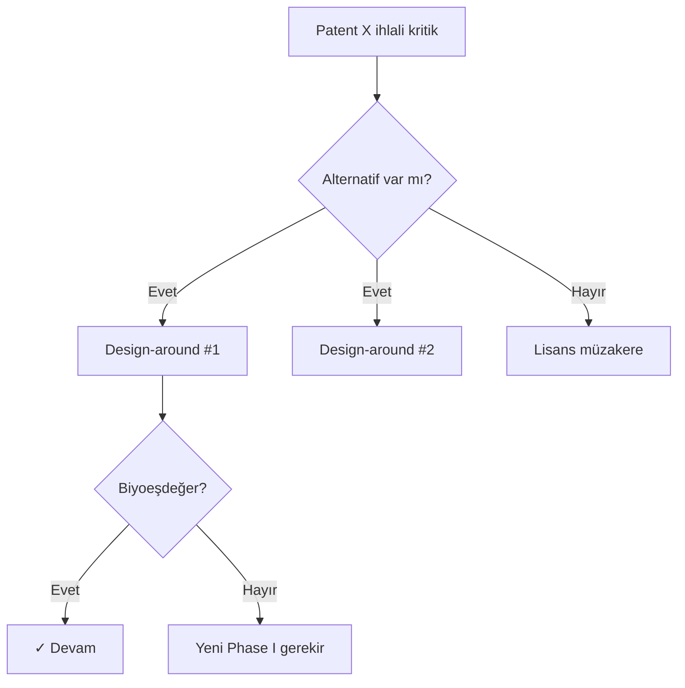
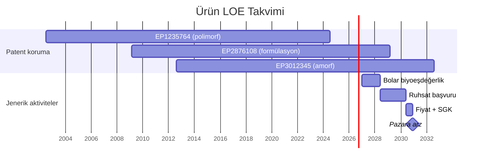
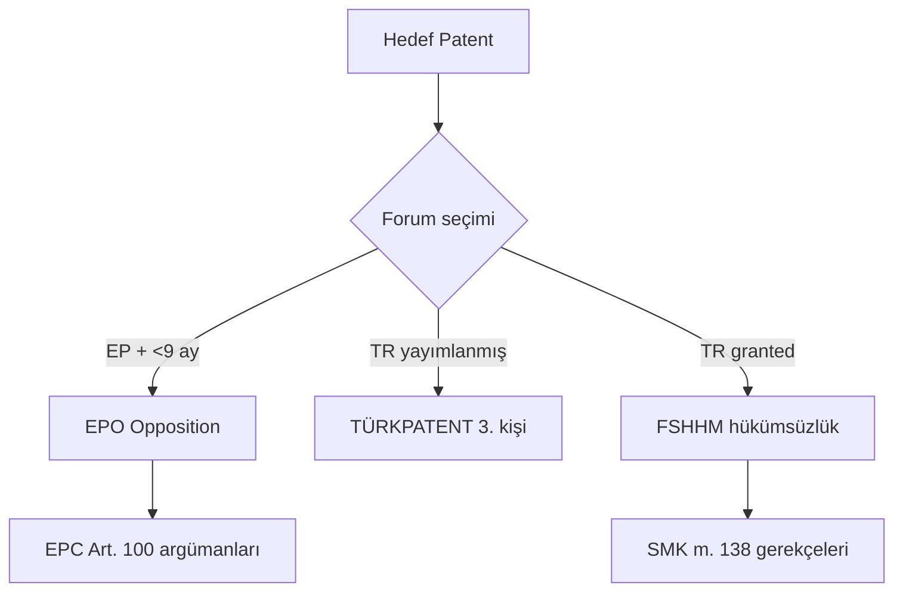
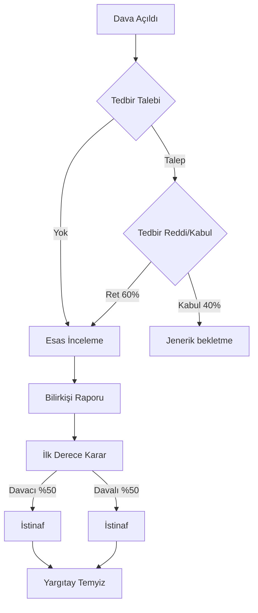
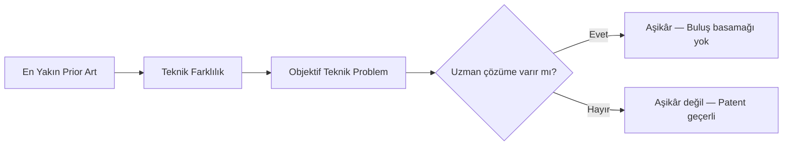

# references/gorsel-standartlari.md — Rapor Şablonları İçin Görsel Standartları

> Metin-ağırlıklı rapor, veri-yoğun içerikte yetersiz kalır. **Patent peyzajı, LOE takvimi, coverage matrisleri ve coverage heatmap'leri** doğru görselleştirildiğinde karar süresini saatlerden dakikalara indirir. Bu protokol, 9 rapor şablonunun her biri için **zorunlu görsel setini** tanımlar, her görselin teknik özelliklerini (SVG boyutları, renk paletleri, tipografi) belirler ve Claude'un `visualize:show_widget` / Carbon HTML / Mermaid / Matplotlib araçlarıyla üretim protokollerini sunar.

## İlişkili Protokoller

- **`rapor-sablonlari.md`** — Her şablonun hangi görseli hangi bölümde kullanacağı bu protokolde tanımlıdır
- **`visualize-widget-kutuphanesi.md`** [v1.5.0] — Bu kılavuzdaki tüm görsel tipleri için hazır, IBM Carbon uyumlu SVG/Mermaid/HTML şablonları. Claude inline görseller için `visualize:show_widget` tool'u ile bu şablonları kullanır.
- **`patent-degerleme.md`** — Monte Carlo dağılımı, tornado chart, duyarlılık analizi görselleri
- **`fto-invalidity-protokol.md`** — Özellik-özellik matrisi, mozaik tablosu, karar ağacı görselleri
- **`biyobenzer-yol.md`** — Biyobenzer takvim Gantt + pazar payı projeksiyon grafikleri

## İçindekiler

1. Görsel üretim araçları seçim rehberi
2. Standart renk paleti ve tipografi
3. Şablon-bazlı görsel setleri (§1-§9)
4. Teknik özellikleri
5. Compliance + imzalama

---

## 1. Görsel üretim araçları seçim rehberi

### Araç matrisi

| Görsel tipi | Birincil araç | Alternatif | Çıktı formatı |
|---|---|---|---|
| Zaman çizelgesi (Gantt) | Mermaid `gantt` | SVG manuel | SVG/PNG |
| Karar ağacı | Mermaid `flowchart` | `visualize:show_widget` | SVG/HTML |
| Matris / Heatmap | HTML + CSS grid | `visualize:show_widget` | SVG/HTML |
| Patent ailesi (citation network) | `visualize:show_widget` + D3.js | Graphviz DOT | SVG |
| Coğrafi coverage (choropleth) | `visualize:show_widget` + SVG | Leaflet (interaktif) | SVG/HTML |
| Bar chart / pie / scatter | `visualize:show_widget` (Recharts) | Carbon Charts | SVG |
| Monte Carlo dağılımı | `visualize:show_widget` + Plotly | Matplotlib | SVG |
| Tornado chart | `visualize:show_widget` | Custom SVG | SVG |

### Araç seçim kuralı

- **Her şablon inline görsel gerektirir** — Claude cevabı içinde görünür olmalı
- Carbon HTML raporları için: görseller SVG olarak embed edilir (Carbon Charts component'leri veya custom SVG)
- docx için: PNG export (SVG → rsvg-convert ile) 300 DPI
- PPTX için: SVG direkt import (`carbon-pptx` skill'i SVG parsing destekler)

### Claude için standart akış

```
1. visualize:read_me(modules=['diagram'] veya ['chart']) — modülü önceden yükle
2. visualize:show_widget(title, widget_code) — inline render
3. Carbon HTML için: SVG kodu rapor HTML'ine <svg>...</svg> olarak gömülür
4. docx için: SVG önce PNG'ye convert edilir (rsvg-convert veya cairosvg)
```

---

## 2. Standart renk paleti ve tipografi

### Semantik renk paleti (IBM Carbon uyumlu)

| Rol | Hex | Kullanım |
|---|---|---|
| **Primary** (aktif / geçerli) | `#0F62FE` | Aktif patent, pozitif karar, yeşil ışık |
| **Danger** (tecavüz / kritik) | `#DA1E28` | İhlal, kritik risk, red flag |
| **Warning** (orta risk) | `#F1C21B` | Uyarı, orta risk, dikkat |
| **Success** (temiz / aşılmış) | `#24A148` | FTO temiz, hükümsüz, LOE geçti |
| **Neutral dark** | `#161616` | Ana metin, kenar çizgileri |
| **Neutral mid** | `#525252` | İkincil metin, orta vurgu |
| **Neutral light** | `#F4F4F4` | Arka plan blokları |
| **Accent 1** (orijinatör) | `#8A3FFC` | Orijinatör firma rengi |
| **Accent 2** (jenerik) | `#08BDBA` | Jenerik/biyobenzer firma rengi |

**CSS değişken formatı** (Carbon HTML için):
```css
:root {
  --pp-primary: #0F62FE;
  --pp-danger: #DA1E28;
  --pp-warning: #F1C21B;
  --pp-success: #24A148;
  --pp-neutral-dark: #161616;
  --pp-neutral-mid: #525252;
  --pp-neutral-light: #F4F4F4;
  --pp-accent-orig: #8A3FFC;
  --pp-accent-gen: #08BDBA;
}
```

### Tipografi

- **Başlıklar**: IBM Plex Sans Medium (Carbon standardı)
- **Metin**: IBM Plex Sans Regular
- **Kod/teknik**: IBM Plex Mono
- **Boyut hiyerarşisi**: 32/24/18/14/12 px

### Yoğunluk kuralları

- **Information density**: Tufte minimum-ink prensibi — gereksiz grid çizgileri yok, kırpma yok, renk overuse yok
- **Accessibility**: WCAG AA kontrast (4.5:1 minimum); renkle birlikte şekil/şema kodu (renk körleri için)
- **Print-safe**: Tüm görseller siyah-beyaza dönüştürüldüğünde de okunabilir olmalı

---

## 3. Şablon-bazlı görsel setleri

### §1 FTO Raporu — zorunlu görseller

#### G1.1 — Patent-Ülke Risk Heatmap

**Amaç**: Her patent × her ülke hücresi risk seviyesiyle renklendirilmiş matris.

**Yapı**:
- Satırlar: tespit edilen patentler (10-30)
- Kolonlar: hedef ülkeler (TR, EP, US, JP, CN, vb.)
- Hücre renk: Kritik (kırmızı) / Yüksek (turuncu) / Orta (sarı) / Düşük (açık yeşil) / Temiz (yeşil)

**Örnek Mermaid**:
```
## İçerilen görsel şablonu

| Patent | TR | EP | US | JP | CN |
|---|---|---|---|---|---|
| EP1235764 | 🔴 Yüksek | 🔴 Yüksek | 🟡 Orta | 🟢 Temiz | ⚪ N/A |
| EP2876108 | 🟡 Orta | 🔴 Yüksek | 🟡 Orta | ⚪ N/A | ⚪ N/A |
```

**HTML/CSS versiyonu** için `visualize:show_widget` içinde grid display.

#### G1.2 — Özellik-Özellik Eşleşme Matrisi

**Amaç**: İstem özelliklerinin (F1-Fn) hedef ürünle eşleşme durumunu göstermek.

**Yapı**:
- Satırlar: her patent için F1, F2, ..., Fn
- Kolonlar: İstem değeri / Hedef ürün değeri / Eşleşme (✓/✗)
- Renk: Eşleşme = danger, No match = success

Detaylar için `fto-invalidity-protokol.md §4`.

#### G1.3 — Design-Around Karar Ağacı

**Amaç**: Kritik patent için alternatif yolların karşılaştırılması.

**Mermaid flowchart**:


#### G1.4 — LOE Gantt Takvimi

**Amaç**: Patent süreleri + veri imtiyazı + Bolar aktiviteleri + ruhsat + pazara arz zaman eksen.

**Mermaid Gantt**:


---

### §2 Invalidity Briefing — zorunlu görseller

#### G2.1 — Mozaik Tablosu (Özellik × Prior Art)

**Amaç**: Hangi prior art belgesi hangi istem özelliğini kapsıyor.

**Yapı**:
- Satırlar: F1, F2, ..., Fn (istem özellikleri)
- Kolonlar: PA1, PA2, ..., PAn (prior art belgeleri)
- Hücre: ✓ kapsıyor / ✗ kapsamıyor / — kısmen

**Renk kodu**:
- Yeşil ✓: tam kapsama
- Sarı ◐: kısmen
- Beyaz ✗: yok

**Kritik gözlem vurgusu**: Tüm özellikleri tek bir belgede kapsayan kolon (yenilik saldırısı) → kırmızı çerçeve.

#### G2.2 — Argüman Güvenilirlik Radar Chart

**Amaç**: Her atak vektörünün (yenilik, obviousness, sufficient disclosure, vs.) güvenilirliğini tek bir görselde.

**Boyutlar**:
- Yenilik yoksunluğu
- Buluş basamağı yoksunluğu
- Yeterli açıklama
- Hak sahipliği
- İkinci tıbbi kullanım yenilik
- Sanayiye uygulanabilirlik

**Ölçü**: Strong=5, Moderate=3, Weak=1.

#### G2.3 — Patent Ailesi Citation Network

**Amaç**: Hedef patent + prior art belgeleri arasındaki atıf ağı.

**Araç**: `visualize:show_widget` + D3.js force-directed graph.

**Nodlar**:
- Hedef patent: büyük kırmızı daire (merkez)
- Patent prior art: mavi daireler (büyüklük = atıf sayısı)
- NPL: yeşil kareler

**Kenarlar**: Direct citation (düz), semantic similarity (kesik).

#### G2.4 — Forum Stratejisi Karar Ağacı

**Mermaid**:


---

### §3 Landscape Raporu — zorunlu görseller

#### G3.1 — Başvuru Sayısı Zaman Serisi

**Amaç**: Teknoloji alanında yıllık patent başvuru hacminin trendi.

**Chart tipi**: Stacked area — her yıl assignee kategorisine göre (big pharma / biotech / academia / emerging markets).

#### G3.2 — Assignee Top-20 Bar Chart

**Amaç**: Patent sahibi konsantrasyonu.

**Ek bilgi**: Her bar için hover → o assignee'nin kritik 3 patent ailesi.

#### G3.3 — Portföy Coğrafi Yayılım Choropleth

**Amaç**: Her ülkenin patent koruma yoğunluğu.

**Harita**: Dünya haritası (SVG), ülke rengi = o ülkede tescilli patent sayısı.

**Renk skalası**: Açık mavi (0-10) → koyu kırmızı (500+).

**Teknik**: D3.js + TopoJSON world map data.

#### G3.4 — Citation Network (Foundational vs Peripheral)

**Amaç**: Alanın temel patentleri + çevresel gelişmeleri.

**Foundational** = çok atıf alan (merkezi düğüm).
**Peripheral** = foundational'a atıf yapanlar (dış halka).

#### G3.5 — Evergreening Katman Haritası

**Amaç**: Spesifik bir ürün için patent katmanları zaman eksenliği.

```
2000━━━2005━━━2010━━━2015━━━2020━━━2025━━━2030━━━2035
 │       │       │       │       │       │       │
 ■━━━━━━━━━━━━━━━━━━━━━━━━━━━━━━━━━━━━━━━━━━━━━━━ Molekül patenti (2000-2020)
         ■━━━━━━━━━━━━━━━━━━━━━━━━━━━━━━━━━━━━━━━ Polimorf patenti (2004-2024)
                 ■━━━━━━━━━━━━━━━━━━━━━━━━━━━━━━ Formülasyon (2009-2029)
                         ■━━━━━━━━━━━━━━━━━━━━━━ Cihaz (2014-2034)
                                 ■━━━━━━━━━━━━━ İkinci tıbbi kullanım (2019-2039)
                                         ■━━━━━ Kombinasyon FDC (2023-2043)
```

---

### §4 Lifecycle Yol Haritası — zorunlu görseller

#### G4.1 — Portföy Zaman Çizelgesi (Gantt)

Her patentin aktif süresi + pending durum + yeni başvuru öncelikleri.

#### G4.2 — Gelir Erozyon Projeksiyonu

**Chart tipi**: Line — peak sales baseline + biyobenzer/jenerik giriş sonrası erozyon eğrisi.

**İki eğri**:
- Orijinal ürün (azalan)
- Biyobenzer/jenerik toplamı (artan)

#### G4.3 — Portföy Yatırım vs Koruma Matrisi

**Quadrant chart**:
- Y ekseni: Patent ömrü kalan (düşük → yüksek)
- X ekseni: Pazarda değer (düşük → yüksek)
- Quadrant 1 (sağ üst): Değerli + uzun ömür → maksimize
- Quadrant 2 (sağ alt): Değerli + kısa ömür → monetize
- Quadrant 3 (sol üst): Düşük değerli + uzun ömür → potansiyel
- Quadrant 4 (sol alt): Düşük değerli + kısa ömür → terk

---

### §5 Pazara Giriş Takvimi — zorunlu görseller

#### G5.1 — LOE Gantt (tüm engelleri entegre)

Patent + veri imtiyazı + Bolar + ruhsat + fiyat/SGK + pazara arz.

Örnek: §1 G1.4 ile benzer yapı.

#### G5.2 — MAX Formülü Görselleştirmesi

**Amaç**: Veri imtiyazı vs patent bitişi karşılaştırması.

**Chart**: Horizontal bar — iki paralel çubuk, kırmızı çizgi MAX noktası.

```
Veri imtiyazı bitişi  ████████░░░░░░░░░░░░░░░░░░  2024-02
                                                  ↑
                                                LOE = 2030-02 (Patent belirleyici)
                                                  ↓
Patent bitişi         █████████████████████░░░░░  2030-02
```

#### G5.3 — Cihaz FTO Bağımlılık Diyagramı

Biyolojik + cihaz entegrasyon noktaları + alternatif tedarikçi senaryoları.

---

### §6 Litigation Briefing — zorunlu görseller

#### G6.1 — Dava Karar Ağacı (Mermaid)

Tüm olası yollar + kararların olasılıklarla.



#### G6.2 — Maliyet-Zaman Eğrisi

**Amaç**: Dava süresince birikimli maliyet.

**Chart**: Line — x: ay, y: kümülatif maliyet (USD).

#### G6.3 — Forum Seçim Matrisi

**Amaç**: FSHHM / EPO / TÜRKPATENT YİDK / ABD PTAB karşılaştırması.

**Tablo formatı**: Forum × Süre × Maliyet × Başarı oranı × Coğrafi etki.

---

### §7 Due Diligence Report — zorunlu görseller

#### G7.1 — Portföy Coverage Coğrafi Heatmap

Her patent × her ülke matris; dolu = koruma var, boş = boşluk.

#### G7.2 — Patent Kuvvet Skor Kartı (Radar)

Her kritik patent için:
- Geçerlilik skoru
- Kapsam genişliği
- Coğrafi yayılım
- Kalan ömür
- Enforceability

#### G7.3 — Monte Carlo Değer Dağılımı

**Amaç**: Portföy değer belirsizliği.

**Chart tipi**: Histogram + P10, P50, P90 çizgileri.

```
Frequency
    │
    │      ██
    │     ████
    │    ██████
    │   ████████
    │  ██████████
    │ ████████████
    │████████████████
    └──────────────────→
   P10      P50      P90    NPV (USD M)
   120      340      780
```

#### G7.4 — Tornado Chart (Duyarlılık)

Her parametrenin (peak sales, PTRS, discount rate, ...) NPV üzerindeki etkisi.

#### G7.5 — Red/Yeşil Bayrak Özeti

**İki-kolon matrisi**:
- Sol: Red flags (kırmızı)
- Sağ: Green flags (yeşil)

---

### §8 Opposition Briefing — zorunlu görseller

#### G8.1 — EPC Article 100 Argüman Haritası

Her gerekçe kategorisi (100(a)(i), 100(a)(ii), 100(b), 100(c)) × argüman gücü.

#### G8.2 — Problem-Solution Akış Diyagramı

**Amaç**: EPO'nun obviousness analitik çerçevesi.



#### G8.3 — Opposition Süreç Gantt

Notice of opposition → sahip cevabı → oral proceedings → karar → temyiz.

---

### §9 Biosimilar Pathway Briefing — zorunlu görseller

#### G9.1 — Patent Duvarı Multi-Layer Gantt

Molekül + formülasyon + cihaz + ikinci tıbbi kullanım patent katmanları + veri imtiyazı.

#### G9.2 — Karşılaştırılabilirlik Paketi Sankey Diyagramı

**Amaç**: CQA → analitik metod → klinik çalışma akışı.

#### G9.3 — Pazar Payı Projeksiyonu Stacked Area

**Amaç**: Referans ürün + biyobenzer 1-2-3 pazar payı 5 yıllık projeksiyon.

#### G9.4 — Üç Jurisdiction Takvim Karşılaştırması

**Amaç**: AB + ABD + TR için biyobenzer yol haritası paralel gösterimi.

**Chart**: 3 paralel Gantt — her biri aynı zaman ekseni.

---

## 4. Teknik özellikleri

### SVG standart boyutları

| Kullanım | Genişlik × Yükseklik | Not |
|---|---|---|
| Inline chat (mobile-friendly) | 600 × 400 px | Claude `visualize` |
| Carbon HTML rapor (full-width) | 1200 × 600 px | Print için 2x retina |
| Carbon PPTX slide (16:9) | 1280 × 720 px | Slide full bleed |
| docx embed (A4) | 800 × 500 px | 4:2.5 oran |

### Font embedding

- SVG içinde font embed: `font-family: 'IBM Plex Sans', sans-serif;`
- Fallback: system sans-serif
- docx export: font hard-baked (convert-to-PNG)

### Accessibility

- `<title>` tag zorunlu (screen readers)
- `<desc>` tag: görselin alternatif metin açıklaması
- Renk bağımsız şema (icons/patterns + color)
- 4.5:1 kontrast minimum

### Dosya konvansiyonu

- Dosya adı: `<rapor-§>-<görsel-no>-<slug>.svg`
- Örnek: `fto-§1.1-patent-ulke-heatmap.svg`, `litigation-§6.1-karar-agaci.svg`
- Carbon HTML dizini: `/charts/` alt dizin
- PNG fallback: aynı dosya adı `.png` uzantısı

---

## 5. Compliance + imzalama

### Rapor-seviyesi görsel compliance

Her rapor görselinde zorunlu:

1. **Kaynak atıfı**: Veri kaynağı alt bilgisinde ("Source: EPAAT, access 2026-04-23")
2. **Tarih damgası**: Görselin oluşturulma tarihi
3. **Hazırlayan**: Skill + versiyon ("pharmapatent v1.3.0")
4. **Disclaimer mini-footer**: "Yönlendirici — nihai karar için vekil onayı"

### Karşı-doğrulama

- Her sayı görselde → aynı sayı metinde (tutarlılık)
- Tarih formatı tutarlı (YYYY-MM-DD)
- Para birimi tutarlı (USD veya TL, karışık değil)

### Git versiyonlama (internal use)

Her önemli görsel bir raporda kalıcılaştırılırsa:
- SVG kaynak dosyası version control altında
- Güncellendiğinde: `<!-- v1.1 2026-04-23: patent count güncellendi -->` comment

---

*Bu protokol, `visualize:show_widget`, Mermaid, Carbon Charts ve custom SVG üretim için standardize edilmiş patern kütüphanesidir. Karmaşık veya interaktif görselleştirme gerektiren özel durumlarda tasarımcı desteği önerilir.*
